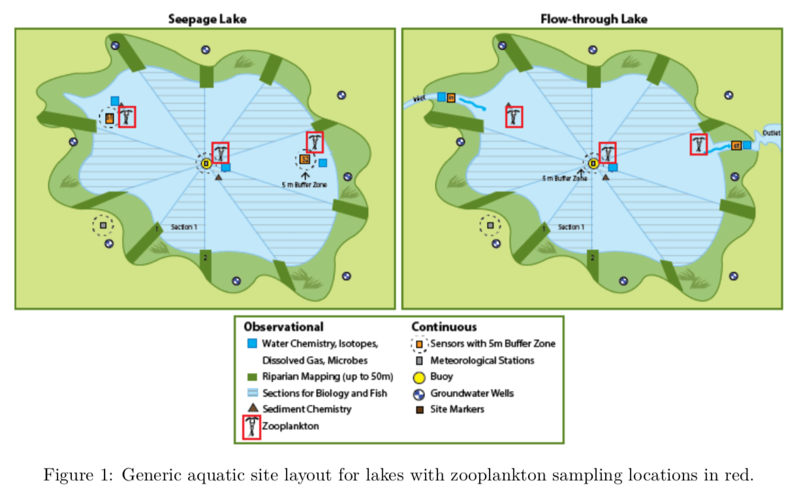

```{r setup, include=FALSE}
knitr::opts_chunk$set(echo = TRUE)
```

# Introduction

The National Ecological Observatory Network (NEON) is an ecological observation facility that collects data on rapidly changing ecological processes in the United States. NEON has standardized data from 81 field sites that span across the United States within 20 Eco-climatic domains that represent regions of distinct land forms, vegetation, climate, and ecosystem dynamics. NEON measures the causes and effects of environmental change in different types of environments and data sets. 

The different types of field sites include core terrestrial sites, core aquatic sites, relocatable terrestrial sites, and relocatable aquatic sites. The different sites ensure that the data will statistically represent ecological, physical, and biological differences spanning the continent. As seen from the image below, the field sites are also in Alaska, Hawaii, and Puerto Rico. This image shows where the NEON sites are located including where the four different types of sites are located [@thorpe2016introduction].


At the varying sites multiple different functional groups of dry mass are recorded depending the location of the site. This includes dry mass of flowers, leaves, mixed, needles, other, seeds, twigs/branches, and woody material. NEON also chose to observe small mammals as they are common to almost every place and they are receptive to changes in the environment. These small mammals are based on a couple different characteristics including taxonomic, behavior, dietary, and size. This data is important for in the use of public health issues like disease prevalence, accounting for the amount of species that are in certain environments, and specifically for climate changes and land use. Specifically, this project looks at a data set on captured zooplakton in lakes at various sites.

Zooplankton are important to study as they inhabit all layers of a body of water and contain a major link between primary production and higher trophic levels in aquatic ecosystems. Unlike other aquatic species, zooplankton are microscopic animals that do not produce their own food. Zooplankton float freely in the water column of lakes and oceans. They not only prey, but they are also consumers in the aquatic food web. Also, they are often filter feeders that feed primarily on algae while being the main food source for fish. An interesting finding is that zooplankton respond to environmental stressors such as nutrientsm ans such effects can be detected through changes in species composition, abundance, and body size distribution. All of this information came from the AOS Protocol and Procedure: Zooplankton Sampling in Lakes. 

Many zooplankton are capable of strong swimming movements and may migrate vertically from tens to hundreds of meters. However, others have limited mobility and depend more on water turbulence to stay afloat. Zooplankton can be classified to developmental stages: meroplankton and holoplankton; and to size [@sabates1989relationship]. The meroplankton spend part of their life as plankton, while holoplankton spend essentially their whole existence in the water column. Freshwater zooplankton are also dominated by six major groups. These include protozoa, rotifers, two subclasses of the Crustacea, the cladocerans and copepods, and *Mysis* and *Chaoborus*.

Seasonality plays an important role in zooplankton species presence and abundance, with cyclopoid and calanoid copepods dominating the community in the winter months, with large cladocera peaking in mid-summer and small cladocera in later summer early autumn [@gerten2002species]. A change in lake trophic conditions from oligotrophic to eutrophic has been shown to result in size-selective predation that potentially contributes to the decline of larger zooplankton, with ciliated protozoans and rotifers becoming more important [@wetzel2001limnology]. 

The Zooplankton sampling is used to quantify biodiversity, number of species present, and biomass (or biovolume) at each lake site. These variables are then used to build a database over time, in order to track changes in zooplankton community structure and function, and introduction of invasive species.

hypothesis: 

# Methods

The Zooplankton collection data came from the NEON website data portal. This data product contains the quality-controlled, native sampling resolution data and metadata from NEON's aquatic zooplankton collection protocol, as well as associated taxonomic, morphometric, and count analyses data provided by a contracted lab.  This data product shows the collection of zooplankton from water column samples in lakes. The collection system used was the Aquatic Observation System (AOS).

## Site Locations and Descriptions

The seven NEON aquatic lake sites where zooplankton collection occured are Toolik (Tool), Barco Lake (BARC), Suggs Lake (SUGG), Prairie Lake at Dakota Coteau Field (PRLA), Prairie Pothole (PRPO), Crampton Lake (CRAM), and Little Rock Lake (LIRO).

The first site TOOL is a core terrestrial site located in Alaska. The site host was the Bureau of Land Management. The data status for this site is only partially available, so not much is known from this site. 

The second site BARC is a core terrestrial site as well. This site is located in Southeast Florida and the site host is the University of Flordia Foundation. Barco Lake is an oligotrophic acidic (pH 4.5) seepage lake, which means it has low nutrient levels and the landscape is formed of soluble rocks. This site is estimated to be at least 1000 years old. The primary vegetation at this site is forest spaced with pine trees and deciduous oaks. Fire is a dominant facotr of the ecology at this site. This site is important breeding areas for terrestrial amphibians including the gopher frog. The lake is a typical lentic water body without a lot of water coming in or out. Water may be largely obtained from groundwater seepage about 8 inches per year. The lake is clear with dissolved organic carbon and a chemistry fluctuation that is highly influenced by rainwater and groundwater interactions. 

The third site SUGG is a core terrestrial site located in Southeat Flordia as well. It also has the site host being University of Florida Foundation. The lake is classified as a Marsh lake with major plant communities that surround it. This late is also a seepage lake like the BARC site, in which the lakes are underlain by the Floridan Aquifer dominated by a limestone and dolomite geology. The primary vegetation that surrounds this lake includes cypress swamps and old pastures. There is an adjacent hardwood forest as well with species that include of the Water Oak, Bald Cycpress and Sweetgum. The site contains a dense population of amphibians like the salamanders. The water flow from this lake is primarily surface water dominated. This lake is classified with water that comes from groundwater, local aquifer, and local surface and subsurface flow through the wetland complex. Similar to the BARC site there is a strong link between the lake and the groundwater. 

The fourth site PRLA is a relocatable aquatic site in the Northern Plains od North Dakota. The site host is the State of North Dakota Land Trust. Just like the first site, the data status for this site is only partially available, so not much is known from this site.

The fifth site PRPO is a core aquatic site also in the Northern Plains of North Dakota. The site host is the U.S. Geological Survey and U.S. Fish and Wildlife Service. This site also has a data status that is only partially available, so not much is known from this site. 

The sixth site CRAM is a core aquatic site located at the Great Lakes in Wisconsin. The site host is the University of Notre Dame Environmental Research Center. The overall vegetation of this site is hardwood forests as well as open water areas and wetlands. The lake at this site is also a seepage lake, and is primarily rain, and groundwater fed. This site however has a slowly flowing inlet from a bog on the northeast edge. The lake is mosly completely covered with ice from November to March. The composition of the lake includes organic muck, silt, and sand. The lake has clear water, and is oligotophic like the BARC site. The pH of the water is neutral (6.5) and is very sensitive to to slight changes of acidity. 

The last site where zooplankton was collected is LIRO. This site is a relocatable aquatic site at the Great Lakes in Wisconsin. The site host is the Wisconsin Department of Natural Resources. Just like three other sites, this site also has a data status that is only partially available, so not much is known from this site.


## Field Sampling Design

Neon scientists' collected Zooplankton samples three times per year at the seven lake sites during biology bount windows, during the seasons of spring, summer, and fall. The three different times periods are significant for various reasons. Sample bout 1 is usually right after the winter season when there is a period of rapid biomass accumulation. Sample bout 2 is during the middle of summer and sample bout 3 happens in the late growing season during leaf-fall. Sampling at each site is completed within a single day for each bout. Zooplankton at NEON sites were sampled from the water column near the NEON sensor sets in lakes. Samples were collected near the inlet, outlet, and deepest sampling locations. This can be seen with the picture below from the NEON user Guide to Aquatic Zooplankton Collection.



The type of sampler used to collect zooplankton was determined by water depth at the location of the site. NEON scientists at locations deeper than 4 m are were sampled using a certical tow net, while locations shallower than 4 m were sampled using a Schindler-Patalas sampler. Up to three traps or samplers were used for the collection. The samplers used for zooplankton collection were designed by the NEON scientists to work by collecting a small amount of the water column at the site. The volume that was collected with a vertical tow net was the area of the tow net opening multiplied by the depth of the tow, multiplied by the number of tows composited in one sample. With the Schindler-Patalas trap there is a clear Lexan box that contains 12 L of water so the volume is 12 L times the number of traps that are in one sample. Once the samples were collected they were preserved in ETOH and sent to a laboratory for taconomic identification. 

## Data Analysis and Statistics

I will be using R studio to conduct statistics on the Zooplankton data. A linear regression will be used to determine if there is a correlation between elevation and individual count of the species *Brachionus havanaensis*. As well as if there is a correlation between the season/date the sample was collected and the abundance. 

# Results

```{r load-packages}
# If you add any additional packages here, make sure they are
# also listed in the DESCRIPTION file
library("dplyr")
library("tidyr")
library("ggplot2")
library("readr")
library("lubridate")
```

```{r read-in-dataset}
# this is the information on location of zooplankton caught
zoo_data <- read_csv("filesToStack20219/stackedFiles/zoo_fieldData.csv")

# this is the info about the taxonomic identity of zooplankton found
zoo_tax <- read_csv("filesToStack20219/stackedFiles/zoo_taxonomyProcessed.csv")
```

```{r combine-datasets}
# this is the combined data from two sets
zoo_all <- zoo_data %>%
  left_join(zoo_tax, by = "siteID")
```

*Figure 1*

```{r plot-usa-zoo-sites}
usa_map <- map_data("usa")

points_with_lat_long <- zoo_all %>%
  filter(!is.na(decimalLatitude)) %>%
  filter(individualCount > 0) %>%
  group_by(siteID) %>%
  summarize(total_count = sum(individualCount),
            mean_lat = mean(decimalLatitude),
            mean_long = mean(decimalLongitude))

ggplot() +
  geom_polygon(data = usa_map,
               aes(x = long,
                   y = lat,
                   group = group),
               fill = "dark blue") +
  coord_fixed(1.3) +
  geom_point(data = points_with_lat_long,
           aes(x = mean_long,
               y = mean_lat,
               size = total_count)) +
  ggtitle("Sites with Zooplankton Abundance")
```

This figure shows the location of the seven sites being observed and their abundance of zooplakton captured at each site. The sites include, Toolik (Tool), Barco Lake (BARC), Suggs Lake (SUGG), Prairie Lake at Dakota Coteau Field (PRLA), Prairie Pothole (PRPO), Crampton Lake (CRAM), and Little Rock Lake (LIRO). Some sites are in the same area and the dot on the map represents more than one site. 

*Figure 2*

```{r boxplot-abundance}
boxplot(individualCount ~ siteID, data = zoo_all,
        main = "Abundance of Zooplankton at each Site",
        xlab = "Site ID", ylab = "Individual Count")
```

This boxplot shows the individual count of zooplakton captured at each site. 

*Figure 3*

```{r species-seen-at-all-sites}
zoo_all %>%
  filter(year(startDate) == 2017) %>%
ggplot(aes(x = scientificName,
           y = siteID)) +
  geom_boxplot() +
  theme(axis.text.x = element_text(angle = 90, hjust = 1))
```

This figure shows the numerous of zooplackton species found at the seven lake sites.  

```{r filter-most-abundant}
most_abundant_spp <- zoo_all %>%
  group_by(scientificName) %>%
  summarize(sum_indiv = sum(individualCount, na.rm = TRUE)) %>%
  arrange(desc(sum_indiv)) %>%
  head() %>%
  pull(scientificName)
```

*Figure 4*

```{r most-abund-timepoint}
zoo_all %>%
  filter(scientificName %in% most_abundant_spp) %>%
  filter(year(startDate) == 2017) %>%
  ggplot(aes(x = as.POSIXct(startDate),
             y = individualCount,
             color = scientificName)) +
    geom_point(alpha = 0.1) +
    geom_smooth(method = "loess",
                se = FALSE) +
  scale_y_log10() +
  ggtitle("Individual Count of Most Abundant Species in the Year 2017")
```

This figure looks at individual count from 2017 of the most abundant species. These six species are types of zooplakton collected. It looks at when the sample was taken, and its abundance at that time.  

*Figure 5*

```{r geomplot-havanaensis}
zoo_all %>%
  filter(scientificName %in% most_abundant_spp) %>%
  filter(year(startDate) == 2017) %>%
  filter(scientificName == "Brachionus havanaensis") %>%
  ggplot(aes(x = as.POSIXct(startDate),
             y = individualCount,
             color = scientificName)) +
    geom_point(alpha = 0.1) +
    geom_smooth(method = "loess",
                se = FALSE) +
  scale_y_log10() +
  ggtitle("Individual Count of Brachionus havanaensis 2017")
```

This figure is a close up of one of the most abundant species *Brachionus havanaensis*. It shows the fluctuation of the amount of zooplakton caught and the time in which month it was collected. This also shows that this species is only seen between early May and late September. 

*Statistic 1*

```{r statistic-date}
zoo_all %>%
  #filter(scientificName %in% most_abundant_spp) %>%
  filter(year(startDate) == 2017) %>%
  filter(scientificName == "Brachionus havanaensis") %>%
  lm(individualCount ~ as.POSIXct(startDate), data = .) %>%
  summary()
```

This linear regression model shows that there is not a correlation between individual count of *Brachionus havanaensis* and the start date the sample was collected. The P value was greater than 0.05 (0.7565), so we accept the null hypothesis and conclude that this is not a significant relationship between zooplakton abundance and the time the sample was collected. The R-squared value (0.000299) indicates that the regression line does not fit the data. 

*Figure 6*

```{r geomplot-ele-havanaensis}
zoo_all %>%
  filter(scientificName %in% most_abundant_spp) %>%
  filter(year(startDate) == 2017) %>%
  filter(scientificName == "Brachionus havanaensis") %>%
  ggplot(aes(x = as.POSIXct(startDate),
             y = elevation,
             color = scientificName)) +
    geom_point(alpha = 0.1) +
    geom_smooth(method = "loess",
                se = FALSE) +
  ggtitle("Elevation of Brachionus havanaensis 2017")
```

This figure shows the varying elevation at the two sites that contain this collected species *Brachionus havanaensis*. These sites include Prairie Lake at Dakota Coteau Field (PRLA) and Prairie Pothole (PRPO). The time period the sample of zooplakton was collected at its elevation is shown above.

*Statistic 2*

```{r statistic-elevation}
zoo_all %>%
  #filter(scientificName %in% most_abundant_spp) %>%
  filter(year(startDate) == 2017) %>%
  filter(scientificName == "Brachionus havanaensis") %>%
  lm(individualCount ~ elevation, data = .) %>%
  summary()
```

This linear regression model shows that there is a correlation between individual count of the species *Brachionus havanaensis* and elevation. The P value was less than 0.05 (4.719e-07), so we reject the null hypothesis and conclude that there is a significant relationship between elevation and zooplakton abundance of *Brachionus havanaensis*. The R-squared value (0.07589) indicates that the regression line fits the data a little, but not much as a perfect fit would be considered (1). 

*Figure 7*

```{r geomplot-mean-length}
zoo_all %>%
  filter(scientificName %in% most_abundant_spp) %>%
  filter(year(startDate) == 2017) %>%
  filter(scientificName == "Brachionus havanaensis") %>%
  ggplot(aes(x = as.POSIXct(startDate),
             y = zooMeanLength,
             color = scientificName)) +
    geom_point(alpha = 0.1) +
    geom_smooth(method = "loess",
                se = FALSE) +
  ggtitle("Mean Length of Brachionus havanaensis 2017")
```

This figure shows the mean length of zooplakton collected in 2017 at the time (start date) they were collected. As you can see there is no difference in length of the zooplakton *Brachionus havanaensis* throughout the time it was collected.

# Discussion

Discuss the results you found in the context of what you know about the site/sites and the predominant types of ecosystems in those locations. Think also about the community dynamics, different types of species interactions, food webs, trophic transfer, energy flow, etc. Should be around 3-4 pages interpreting your results and considering future directions you could take in analyzing these data.

# Sources Cited

