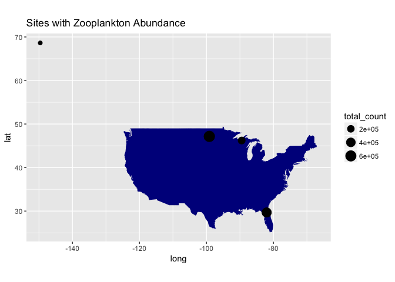
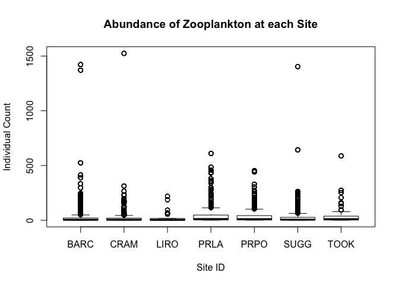
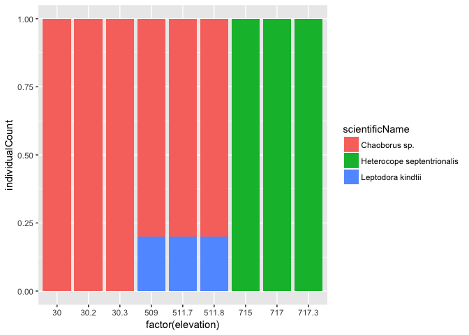
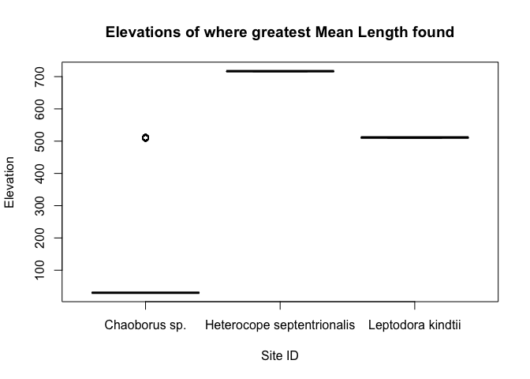
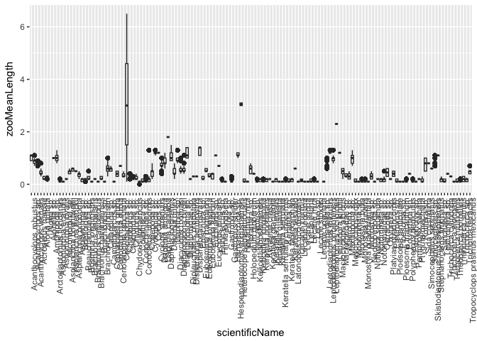

Final Report
================
Courtney Lopez
4/3/2018

Introduction
============

Delete this placeholder text, and replace it with your introduction text. You should include background on the NEON project including proper citations (e.g. (Thorpe et al. 2016)) and other relevent background information related to your specific hypotheses. Add about 2-3 pages here. Across the whole manuscript, you should cite at least 20 peer reviewed articles.

Methods
=======

Describe where the data came from, including the sets of sites you are comparing, how the data you are using were collected in the field, some information about those sites and why you chose them, and how you are analyzing them (e.g. using R to visualize the results and the statistical tests you will use).

Site Locations and Descriptions
-------------------------------

Add text here. In this section instead of first person (I/we), use 'NEON', or 'NEON scientists', since you'll just be describing what they did.

Field Sampling Design
---------------------

Add text here. Add text here. In this section instead of first person (I/we), use 'NEON', or 'NEON scientists', since you'll just be describing what they did.

Data Analysis and Statistics
----------------------------

Add text here. Here this is all your work, so 'I/we' is fine.

Results
=======

Subsections are ok in the results section too
---------------------------------------------

Add a number of code chunks in the Results section. These should read in, subset and plot the data as needed (no need to save any figures to pdf, since they will be put into the rendered document when you click 'knit'), and, for any hypotheses that you want to test, an appropriate statistical test. You should have at least 5-10 figures and/or tables in this section, which you use to test your hypotheses against the dataset.

``` r
# If you add any additional packages here, make sure they are
# also listed in the DESCRIPTION file
library("dplyr")
```

    ## 
    ## Attaching package: 'dplyr'

    ## The following objects are masked from 'package:stats':
    ## 
    ##     filter, lag

    ## The following objects are masked from 'package:base':
    ## 
    ##     intersect, setdiff, setequal, union

``` r
library("tidyr")
library("ggplot2")
library("readr")
```

``` r
# this is the information on location of zooplankton caught
zoo_data <- read_csv("filesToStack20219/stackedFiles/zoo_fieldData.csv")
```

    ## Parsed with column specification:
    ## cols(
    ##   .default = col_character(),
    ##   decimalLatitude = col_double(),
    ##   decimalLongitude = col_double(),
    ##   coordinateUncertainty = col_double(),
    ##   additionalCoordUncertainty = col_integer(),
    ##   elevation = col_double(),
    ##   elevationUncertainty = col_double(),
    ##   startDate = col_datetime(format = ""),
    ##   collectDate = col_datetime(format = ""),
    ##   towsTrapsNumber = col_integer(),
    ##   towsTrapsVolume = col_double(),
    ##   zooDepth1 = col_double(),
    ##   zooDepth2 = col_double(),
    ##   zooDepth3 = col_double()
    ## )

    ## See spec(...) for full column specifications.

``` r
# this is the info about the taxonomic identity of zooplankton found
zoo_tax <- read_csv("filesToStack20219/stackedFiles/zoo_taxonomyProcessed.csv")
```

    ## Parsed with column specification:
    ## cols(
    ##   .default = col_character(),
    ##   collectDate = col_datetime(format = ""),
    ##   identifiedDate = col_date(format = ""),
    ##   zooMinimumLength = col_double(),
    ##   zooMaximumLength = col_double(),
    ##   zooMeanLength = col_double(),
    ##   zooWidth = col_double(),
    ##   individualCount = col_integer(),
    ##   zooVolumePerBottle = col_integer(),
    ##   zooSubsampleVolume = col_integer(),
    ##   adjCountPerBottle = col_integer()
    ## )
    ## See spec(...) for full column specifications.

    ## Warning in rbind(names(probs), probs_f): number of columns of result is not
    ## a multiple of vector length (arg 2)

    ## Warning: 1 parsing failure.
    ## row # A tibble: 1 x 5 col     row col               expected               actual file               expected   <int> <chr>             <chr>                  <chr>  <chr>              actual 1  1367 adjCountPerBottle no trailing characters e+05   'filesToStack2021… file # A tibble: 1 x 5

``` r
# this is the combined data from two sets
zoo_all <- zoo_data %>%
  left_join(zoo_tax, by = "siteID")
```

``` r
usa_map <- map_data("usa")
```

    ## Warning: package 'maps' was built under R version 3.4.4

``` r
points_with_lat_long <- zoo_all %>%
  filter(!is.na(decimalLatitude)) %>%
  filter(individualCount > 0) %>%
  group_by(siteID) %>%
  summarize(total_count = sum(individualCount),
            mean_lat = mean(decimalLatitude),
            mean_long = mean(decimalLongitude))

ggplot() +
  geom_polygon(data = usa_map,
               aes(x = long,
                   y = lat,
                   group = group),
               fill = "dark blue") +
  coord_fixed(1.3) +
  geom_point(data = points_with_lat_long,
           aes(x = mean_long,
               y = mean_lat,
               size = total_count)) +
  ggtitle("Sites with Zooplankton")
```



``` r
boxplot(individualCount ~ siteID, data = zoo_all,
        main = "Abundance of Zooplankton at each Site",
        xlab = "Site ID", ylab = "Individual Count")
```



``` r
comb_data <- zoo_all %>%
  filter(scientificName %in% c("Chaoborus sp.",
         "Heterocope septentrionalis",
         "Leptodora kindtii")) %>%
  group_by(siteID, scientificName) %>%
  tally() %>%
  arrange(desc(n))
```

``` r
elevation_data <- zoo_all %>%
  filter(scientificName %in% c("Chaoborus sp.",
         "Heterocope septentrionalis",
         "Leptodora kindtii"))
```

``` r
ggplot(elevation_data,
       aes(x = factor(elevation),
           y = individualCount,
           fill = scientificName)) +
  geom_col(position = position_fill())
```



``` r
boxplot(elevation ~ scientificName, data = elevation_data,
        main = "Elevations of where greatest Mean Length found",
        xlab = "Site ID", ylab = "Elevation")
```



``` r
ggplot(zoo_all, aes(x = scientificName,
                    y = zooMeanLength)) +
  geom_boxplot() +
  theme(axis.text.x = element_text(angle=90, hjust=1)) 
```

    ## Warning: Removed 1488 rows containing non-finite values (stat_boxplot).



``` r
# elevation_data %>%
#   summarize(mean_count = mean(n, na.rm = TRUE)) %>%
#   lm(mean_count ~ elevation, data = .) %>%
#   summary()
```

In addition to a minimum of 5-10 figures/tables (and associated captions), you should include sufficient text in this section to describe what your findings were. Remember that in the Results section you just describe what you found, but you don't interpret it - that happens in the Discussion. 2-3 pages.

Discussion
==========

Discuss the results you found in the context of what you know about the site/sites and the predominant types of ecosystems in those locations. Think also about the community dynamics, different types of species interactions, food webs, trophic transfer, energy flow, etc. Should be around 3-4 pages interpreting your results and considering future directions you could take in analyzing these data.

Sources Cited
=============

Thorpe, A. S., D. T. Barnett, S. C. Elmendorf, E.-L. S. Hinckley, D. Hoekman, K. D. Jones, K. E. LeVan, C. L. Meier, L. F. Stanish, and K. M. Thibault. 2016. Introduction to the sampling designs of the national ecological observatory network terrestrial observation system. Ecosphere 7.
